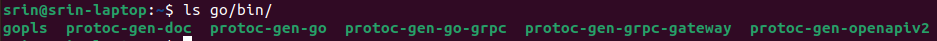

# A Guide to Start gRPC Gateway

This repository contains a guide to Start gRPC Gateway Server to proxy REST request from client to gRPC Services.

Read more about gRPC Gateway [here](https://grpc-ecosystem.github.io/grpc-gateway/).

## Prerequisites

There are some things that you need to do before start this guide:

1. Install [Go Programming Language](https://go.dev/). For now, gRPC Server only support Go for its language.
2. Install [Protocol Buffer Compiler](https://grpc.io/docs/protoc-installation/)(protoc). This tool is needed for generate Go Stubs from our proto file(s).

This guide created in environment:

- Linux Ubuntu 22.04

## Guidelines

### 1. Run Simple gRPC Server

We are provide simple gRPC Server for this guide. Find it in [this repo](https://github.com/dinokey/simple-grpc-server). Just clone the repo and run.

Just run the server with command `./gradlew bootRun`. The Server will run in localhost at port 9090.

_Note: In order to run this Server you need to install Java 17 in your system_

### 2. Install Required Go modules for Protoc (Protocol Buffer Compiler)

You need installs the protoc generator plugins, we need it to generate the Go stubs.

```sh
go install \
    github.com/grpc-ecosystem/grpc-gateway/v2/protoc-gen-grpc-gateway@latest \
    github.com/grpc-ecosystem/grpc-gateway/v2/protoc-gen-openapiv2@latest \
    google.golang.org/protobuf/cmd/protoc-gen-go@latest \
    google.golang.org/grpc/cmd/protoc-gen-go-grpc@latest
```

This will place four binaries in your `$GOBIN`;

- protoc-gen-grpc-gateway
- protoc-gen-openapiv2
- protoc-gen-go
- protoc-gen-go-grpc

You can check it with command `ls $GOBIN`


Make sure that your `$GOBIN` is in your `$PATH`.

### 3. Prepare Your gRPC Gateway Server Project

Create your dRPC Gateway Server Project with structure below:

```
grpc-gateway
|--employee-service
|--salary-service
|--type
|--server
```

where:

- `grpc-gateway`: name of your gRPC gateway project
- `employee-service`: directory where you placed Go stubs of employeeService.proto
- `salary-service`: directory where you placed Go stubs of salaryService.proto
- `type`: directory where you placed Go stubs of type/\*.proto
- `server`: directory where you code gRPC gateway server

Make sure you create **grpc-gateway** project at same level with [simple-grpc-server](#1-run-simple-grpc-server).

### 4. Generate Go Stubs from Proto Files

You need to generate Go Stubs for every gRPC Service from its proto files. You can find the proto files in [simple-grpc-server](#1-run-simple-grpc-server) project in folder `src/main/proto.`

Make sure you are in root of `grpc-gateway` project. Generate Go stubs for employeeService.proto, here is the structure of the command:

```sh
protoc --proto_path $pathToProject/simple-grpc-server/src/main/proto \
    --proto_path $pathToProject/simple-grpc-server/build/extracted-include-protos/main \
    --go_out ./employee-service --go_opt paths=source_relative \
    --go-grpc_out ./employee-service --go-grpc_opt paths=source_relative \
    --grpc-gateway_out ./employee-service --grpc-gateway_opt paths=source_relative \
    --experimental_allow_proto3_optional \
    $pathToProject/simple-grpc-server/src/main/proto/example/demo/v1/service/employeeService.proto
```

Change `$pathToProject` to your relative path to project, e.g. `/home/dino/grpc`.

**You need to wait for seconds** (Sometimes generating process take times). If the generating process success, your project structure should look like:
```
grpc-gateway
|--employee-service
   |--example
      |--demo
         |--v1
            |--service
               employeeService_grpc.pb.go
               employeeService.pb.go
               employeeService.pb.gw.go
|--salary-service
|--type
|--server
```

Do the same thing for `salaryService.proto`. Just change the command above with out dir to `salary-service` and change proto file name to `salaryService.proto`. 

If the generating process success, your project structure should look like:
```
grpc-gateway
|--employee-service
   |--example
      |--demo
         |--v1
            |--service
               employeeService_grpc.pb.go
               employeeService.pb.go
               employeeService.pb.gw.go
|--salary-service
   |--example
      |--demo
         |--v1
            |--service
               salaryService_grpc.pb.go
               salaryService.pb.go
               salaryService.pb.gw.go
|--type
|--server
```

Next, do the same thing for `employee.proto` and `salary.proto`. In this case, we the proto files doesn't have service definition, so we can generate it into single directory. The command may looks like:
```sh
protoc --proto_path $pathToProject/simple-grpc-server/src/main/proto \
    --proto_path $pathToProject/simple-grpc-server/build/extracted-include-protos/main \
    --go_out ./employee-service --go_opt paths=source_relative \
    --go-grpc_out ./employee-service --go-grpc_opt paths=source_relative \
    --grpc-gateway_out ./employee-service --grpc-gateway_opt paths=source_relative \
    --experimental_allow_proto3_optional \
    $pathToProject/simple-grpc-server/src/main/proto/example/demo/v1/type/*.proto
```

The `'*.proto'` means all proto files inside directory.

If the generating process success, your project structure should look like:
```
grpc-gateway
|--employee-service
   |--example
      |--demo
         |--v1
            |--service
               employeeService_grpc.pb.go
               employeeService.pb.go
               employeeService.pb.gw.go
|--salary-service
   |--example
      |--demo
         |--v1
            |--service
               salaryService_grpc.pb.go
               salaryService.pb.go
               salaryService.pb.gw.go
|--type
   |--example
      |--demo
         |--v1
            |--type
               employee.pb.go
               salary.pb.go
|--server
```

And now, create the gRPC Gateway Server inside `server` folder, named it `main.go`. The content may looks like:
```go
package main

import (
	"context"
	"flag"
	"net/http"

	"github.com/golang/glog"
	"github.com/grpc-ecosystem/grpc-gateway/v2/runtime"
	"google.golang.org/grpc"
	"google.golang.org/grpc/credentials/insecure"

	employeeService "github.com/example/service/employee"
	salaryService "github.com/example/service/salary"
)

var (
	// command-line options:
	// gRPC server endpoint
	grpcServerEndpoint  = flag.String("grpc-server-endpoint", "localhost:9090", "gRPC server endpoint")
)

func run() error {
	ctx := context.Background()
	ctx, cancel := context.WithCancel(ctx)
	defer cancel()

	// Register gRPC server endpoint
	// Note: Make sure the gRPC server is running properly and accessible
	mux := runtime.NewServeMux()
	opts := []grpc.DialOption{grpc.WithTransportCredentials(insecure.NewCredentials())}
	err := employeeService.RegisterEmployeeServiceHandlerFromEndpoint(ctx, mux, *grpcServerEndpoint, opts)
	if err != nil {
		return err
	}
	
	err2 := salaryService.RegisterSalaryServiceHandlerFromEndpoint(ctx, mux, *grpcServerEndpoint, opts)
	if err2 != nil {
		return err2
	}

	// Start HTTP server (and proxy calls to gRPC server endpoint)
	return http.ListenAndServe(":8081", mux)
}

func main() {
	flag.Parse()
	defer glog.Flush()

	if err := run(); err != nil {
		glog.Fatal(err)
	}
}
```

### 5. Wrap all Go Stubs as Go Module

In this step, you need to define all Stubs as Go module. So, it can me imported to another Go module.

Change your terminal directory to a directory where file(s) `.pb.go` located. For example at `grpc-gateway/employee-service/samsung/example/demo/v1/service`. Then run command below:  
```sh
go mod init github.com/example/service/employee
```

The name of Go module must be same with `go_package` option inside `employeeService.proto`

Then, `go.mod` will appear. Now, the project structure should look like:
```
grpc-gateway
|--employee-service
   |--example
      |--demo
         |--v1
            |--service
               employeeService_grpc.pb.go
               employeeService.pb.go
               employeeService.pb.gw.go
               go.mod
|--salary-service
   |--example
      |--demo
         |--v1
            |--service
               salaryService_grpc.pb.go
               salaryService.pb.go
               salaryService.pb.gw.go
|--type
   |--example
      |--demo
         |--v1
            |--type
               employee.pb.go
               salary.pb.go
|--server
   main.go
```

Do the same thing to other directory and your project directory looks like:
```
grpc-gateway
|--employee-service
   |--example
      |--demo
         |--v1
            |--service
               employeeService_grpc.pb.go
               employeeService.pb.go
               employeeService.pb.gw.go
               go.mod
|--salary-service
   |--example
      |--demo
         |--v1
            |--service
               salaryService_grpc.pb.go
               salaryService.pb.go
               salaryService.pb.gw.go
               go.mod
|--type
   |--example
      |--demo
         |--v1
            |--type
               employee.pb.go
               salary.pb.go
               go.mod
|--server
   main.go
   go.mod
```

### 6. Tidy up our Go Module

In every Go modules that we created before, we need to run command `go mod tidy`.
The command aims to manage our module dependencies, add the missing and removes unused module dependencies.

Lets take example at `employee-service`. 
Change your terminal directory to `employee-service/samsung/example/demo/v1/service` and run command:
```sh
go mod tidy
```

And you will find error:
```error
github.com/example/service/employee imports
        github.com/example/types: cannot find module providing package github.com/example/types: module github.com/example/types: git ls-remote -q origin in /home/srin/go/pkg/mod/cache/vcs/888ec4ca3da64b8aec2cdfcbee76d0ef598d08bbfdf269db419003ba5e6d18ad: exit status 128:
        remote: Repository not found.
        fatal: repository 'https://github.com/example/types/' not found
```

This error occurred because module `github.com/example/types` not found at remote registry. We can fix it by routing the module dependency to get `github.com/example/types` module from our local, below is the command:
```
go mod edit -replace github.com/example/types=../../../../../type/example/demo/v1/type
```

Then, run command `go mod tidy` again, and it should success.

Do the same thing to other modules (`salaryService` and `type`).

### 7. Run the gRPC Gateway Server

And now, lets run our gRPC Server!
Go to `server` directory and run command `go mod tidy`. If error 'module not found' happen, fix it like step above.

After that, run the server by run command `go run main.go`

### 8. Let's test our Gateway Server!

All the endpoints should be success:
```
curl http://localhost:8081/v1/employees/john

result:
{
  "empId": "john",
  "name": "John Doe",
  "joinDate": {
    "year": 2020,
    "month": 1,
    "day": 11
  },
  "role": "HR"
}
```
```
curl -X POST -d '{"name":"dino","join_date":{"year":2021,"month":12,"day":3},"role":"USER"}' http://localhost:8081/v1/employees:registerEmployee

result:
{
  "empId": "1qBX3473m6",
  "name": "dino",
  "joinDate": {
    "year": 2021,
    "month": 12,
    "day": 3
  },
  "role": "USER"
}
```
```
curl http://localhost:8081/v1/salaries/john

result:
{
  "empId": "john",
  "name": "John Doe",
  "salary": 10000000,
  "bonus": 3000000
}
```
```
curl -X PUT -d '{"emp_id": "dino", "salary": 10000000}' http://localhost:8081/v1/salaries:updateSalary

result:
{
  "empId": "dino",
  "name": "John Doe",
  "salary": 10000000,
  "bonus": 3000000
}
```